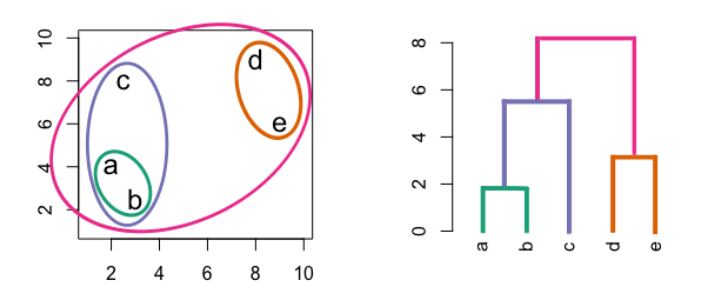

```{r setup, include=FALSE}
knitr::opts_chunk$set(echo = TRUE)
```

# Загрузим данные и пакеты

```{r}
# Загрузим библиотеки
library(dplyr)
library(ggplot2)
theme_set(theme_minimal()) #чтобы в графиках была одна и та же тема (один шрифт  и тд)
library(ggpubr)

pima <- openxlsx::read.xlsx('pima.xlsx')

# Сделаем более детализированную переменную возрастных групп
pima <- pima %>% 
  mutate(
    age_group = case_when(
      age < 31 ~ "21-30",
      age >= 31 & age < 41 ~ "31-40",
      age >= 41 & age < 51 ~ "41-50",
      age >= 51 & age < 61 ~ "51-60",
      age >= 61 ~ "60+"
    )) #преобразовываем колонку по сложному множественному условию, пишем условный ifelse (чтобы много раз не писать ifelse есть команда case_when. если есть строки не попадающие под условия, то становятся NA, либо можем прописать .default = something)
table(pima$age_group)
```

...

# Анализ корреляций

Когда мы говорим об отношениях переменных друг к другу, мы так или иначе приходим к языку корреляции. Т.е.
статистической взаимосвязи двух или более случайных величин при которых изменения в одной переменной связаны с
изменением во второй.

На всякий случай привожу формулу рассчёта коэффициента корреляции Пирсона:

$r_{xy}=\frac{\Sigma(x_i-\bar{x})\times(y_i-\bar{y})}{\sqrt{\Sigma(x_i-\bar{x})^2\times\Sigma(y_i-\bar{y})^2}}$

Он может принимать значения от -1 (отрицательная связь), до 1 (положительная связь).

В R можно строить матрицу корреляций для всех численных переменных нашего датасета с помощью пакета `corrplot`. Загрузим
его:

```{r}
library(corrplot)
```

Сама матрица строится в 2 этапа.

1.  Получаем объект матрицы:

```{r}
summary(pima)
```

Просто сделали дф без строчек, где 0 или NA, если важны строчки, то есть инпутация

```{r}
# Для более "чистого" результата, избавляемся от ошибочных значений
pima_clear <- pima %>% 
  filter(glucose != 0 & pressure != 0 & triceps != 0 & insulin != 0 & mass != 0 & age != 0 ) %>% 
  select(is.integer | is.numeric) # Обратите внимание, в dplyr можно задавать выборку колонок через команды определения формата данных

# Сделаем ещё один "чистый" датафрейм, но со значениями диабет статуса. Он понадобится нам в самом конце занятия 
pima_clear_with_ch <- pima %>% 
  filter(glucose != 0 & pressure != 0 & triceps != 0 & insulin != 0 & mass != 0 & age != 0 )


head(pima_clear)
```

```{r}
# Получаем непосредственно матрицу
pima_cor <- cor(pima_clear) 
pima_cor
```

2.  Визуализируем её в corrplot:

```{r}
corrplot(pima_cor, method = 'number')
```

У представления такой матрицы может быть ещё большое количество вариаций. Их можно посомтреть
[здесь](https://cran.r-project.org/web/packages/corrplot/vignettes/corrplot-intro.html).

Например: method = , type = - самые важные функции col = COL2() - выбираем какой цвет политры и количество шагов

```{r}
corrplot(pima_cor, method = "color", type = "lower", 
         addCoef.col = "grey30", diag = FALSE,
         cl.pos = "b", tl.col = "grey10",
         col = COL2('RdBu', 10))
```

Кроме того, я рекомендую посмотреть также на пакет
[corrr](https://drsimonj.svbtle.com/exploring-correlations-in-r-with-corrr).

В нём реализованы более дателизированные функции для анализа корреляций. Например функция ниже показывает не только
корреляционные взаимосвязи, но и отношения близости переменных друг к другу с точки зрения сетевого анализа:

```{r}
library(corrr)

pima_cor %>% 
  network_plot(min_cor = .0)
```

Такие графики осмысленно использовать тогда когда у вас небольшое (до 20-30) количество переменных.

...

## Матричные графики

С помощью таких графиков можно получить информацию как о распределении отдельных количественных переменных, так и о
взаимосвязи внутри каждой пары количественных переменных.

Можно использовать функцию `ggpairs` из пакета `GGally`:

```{r}
library(GGally)
ggpairs(pima_clear, progress = F)
```

Можно сделать дизайн красивше (спасибо Ольге Мироненко за реализацию):

```{r}
# Решение будет хорошо работать, когда в наших данных не больше 7 колонок. Сделаем выборку для иллюстрации
pima_cor_sampl <- cor(pima_clear[,1:7]) 

# Сначала напишем функции для разных типов графиков корреляций

# Параметры для диаграмм рассеяния
panel.scat <- function(data, mapping) {
  ggplot(data = data, mapping = mapping) +
    geom_point(color = "#4E79A7", size = 1, alpha = 0.5) +
    scale_y_continuous(label = scales::label_number(scale_cut = scales::cut_long_scale())) +
    theme_minimal(base_size = 10) +
    theme(panel.grid.major = element_line(color = "grey90", size = 0.4),
          panel.grid.minor = element_line(color = "grey90", size = 0.2),
          axis.ticks = element_line(size = 0.4, colour = "grey50"))
} 

# Параметры для гистограмм
panel.hist <- function(data, mapping) {
  ggplot(data = data, mapping = mapping) +
    geom_histogram(fill = "#4E79A7", color = "white", bins = 7) +
    scale_x_continuous(label = scales::label_number(scale_cut = scales::cut_long_scale())) +
    theme_minimal(base_size = 10) +
    theme(panel.grid.major = element_blank(),
          panel.grid.minor = element_blank(),
          axis.ticks.y = element_blank(),
          axis.text.y = element_blank(),
          axis.ticks = element_line(size = 0.4, colour = "grey50"))
} 

# Параметры для коэффициентов корреляции
panel.cor <- function(data, mapping){
  ggally_cor(data = data, mapping = mapping, 
             digits = 2, stars = FALSE, title = "Correlation") + 
    theme_void() +
    theme(panel.border = element_blank())
}

# Применим функции все вместе
ggpairs(pima_clear, switch = "y",
        diag = list(continuous = panel.hist),
        upper = list(continuous = panel.cor),
        lower = list(continuous = panel.scat),
        progress = FALSE) +
  theme(strip.background = element_blank(),
        strip.text = element_text(size = 11, face = "bold"),
        strip.placement = "outside",
          axis.text.x = element_text(angle = 45))
```

Если много колонок, данные устроены сложнее, корреляции сами по себе их не схватывают, в данных есть кластера - группы
наблюдений со схожими показателями по разным колонкам. Если колонок до 30 то можно использовать обычные базовые методы
корреляции, если больше, то нужно обращаться к более приспособленным методам, чек дальше.

# Heat map

## Анализ наблюдений

Кластеры - наборы наблюдений, у которых колонки устроены похожим образом

Второй способ использовать heat map - представлять сами наблюдения по какому-то универсальному признаку.

Например, мы можем применить процедуру стандартизации значений для всех наблюдений по численным переменным и
визуализировать его. Можно поверхностно оценить кластеризацию данных. Для того, чтобы оценить строки, значния внутри
которых сильно отличаются необходимо шкалирование Как для анализа кластеризации, так и для анализа главных компонент -
они зависимы, чтобы данные были представлены в одной и той же шкале. (видимо z-шкале)

Стандартизируем значения (шкалирование):

```{r}
pima_clear_scaled <- scale(pima_clear)
head(pima_clear_scaled)
```

Визуализируем с помощью расширения к ggplot - ggfortify() - для создания heatmap. В чем проблема такого графика? Плохо
все понятно, но визуально уже можно оценить поверхностно что к чему.

```{r}
library(ggfortify) 

autoplot(pima_clear_scaled)
```

И теперь задача скорее сгруппировать, чтобы были яркие с яркими и визуализировать это по отдельности

...

# Поиск схожих наблюдений. Лирическое отступление об основах кластерного анализа


х и у в равных шкалах. Как ищем кластера - в пространстве наших измерений измерим расстояние между точками всеми - получаем матрицу расстояний. Дальше ищем минимальное расстояние и это будет кластер, дальше снова измеряем расстояние между первым кластером и остальными точками и тд. Так по порядку укладываем данные. Самый базовый тип кластеризации. Истинное число кластеров неизвестно, сами определяем


# Heat map + Tree map?

Мы затронули основы кластеризации, чтобы понять, как работать в тех случаях, когда нам нужно упорядочить данные, сгруппировав наблюдения. Совместив это с heat map мы можем выделить группы наблюдений по каким-либо признакам.

Сделать это просто через пакет pheatmap.

Загрузим его.

```{r}
library(pheatmap)
```

Визуализируем heat map и tree map одновременно:
Сначала создали матрицу дистанций dist() и загоняем в pheatmap. Он задает кластера по матрице дистанций, которую создали.
Cultree_rows = - сколько считаем должно быть кластеров.
Переупорядочивание в соответствии с кластерными дистанциями. 

```{r}
pima_clear_dist <- dist(pima_clear_scaled)


pheatmap(pima_clear_scaled, 
         show_rownames = FALSE, 
         clustering_distance_rows = pima_clear_dist,
         clustering_method = "ward.D2", 
         cutree_rows = 5,
         cutree_cols = length(colnames(pima_clear_scaled)),
         angle_col = 45, 
         main = "Dendrograms for clustering rows and columns with heatmap")
```
Быстрый способ посмотреть на данные. Смотрим где очевидно совпадают значения. Можно понять из чего состоят данные. Можно предположить гипотезы и проверить их на тестах. Эксплораторный анализ. 

Если еще есть качественные переменные, то можно делать на них и кластеризацию и РСА, но нужно приводить к определенным колонкам и типам данных и считать не евклидово расстояние, а расстояние Говера (для оценки дами колонок).

Мы не знаем есть ли у нас в данных кластера или нет, мы проверяем мб найдем очевидные, вдруг сразу увидим сильно отличающиеся кластеры. С помощью кластеризации видны более сложные отношения колонок. Можно анализировать почему наблюдения схожи между собой и предсказывать поведение элементов попавших в тот или иной кластер. 

Если нужно разбираться с колонками, то PCA, если со строками (то есть много колонок) - много параметров в одной строке, то кластеризация.

# Principal component analysis (PCA)

Сейчас мы уже можем выделить определённые группы пациентов. Однако даже на таком маленьком объёме данных (напомню, мы работаем с 392 наблюдениями) график почти не читаем. Что делать?

Одно из самых популярных решений - метод главных компонент (principal component analysis или PCA). Позволяет технически свести бесконечное количество колонок к двум и отобразить через них график.

...

## Теория и учебный пример

Чтобы разбраться с методом рассмотрим какие две проблемы он решает и как он это делает:

1.  Если в данных есть ряд скоррелированных переменных (например, в нашем случае - mass и triceps), то они не дают провести корректные оценки данных и выделение паттернов.

Почему?
Когда анилизруем несколько скоррелированных между собой колонок, то рожадется мультиколлинеарность (или как то так) - когда хотим проверить сильно ли меняется переменная у в связи с переменной х и q. Х и q сильно скоррелированы, это рождает такую штуку, когда скоррелированность двух переменных повышает качество модели искусственно, взимоусивают такие переменные. В попытке решить эту проблему появился такой анализ РСА

2.  Если в данных очень много наблюдений и переменных, то при разведывательном анализе необходимо сократить их размер, не потеряв в качестве и полноте интерпретаций. Эту задачу выполняют методы уменьшения размерности и PCA относится к ним.

...

Рассмотрим учебный пример. Допустим у нас в данных есть только колонки mass и triceps. Мы хотим с одной стороны снять корреляцию между ними, а с другой - уменьшить размерность, т.е. представить их одной переменной.

```         
Как нам это сделать?
```

...

**Мы можем сконструировать новые переменные из двух имеющихся и сняв корреляцию и уменьшив размерность!**

```{r}
# Подготовим данные
pima_example <- pima_clear %>% 
  select(mass, triceps)

# Визуализируем
ggplot() +
  geom_point(data = pima_example, aes(x = mass, y = triceps)) +
  theme_minimal()

# Что значит такое распределение точек? 
```
Нужно теперь сделать что-то, чтобы наше облако легло на горизонтальную ось, чтобы линия тренда стала линией на горизонтальной оси. Для этого нужно делать арифметические операции (сложение вычитание и тд)

**Сконструируем переменные, в которых не будет корреляции и которые (делаем из бага фичу!) помогут уменьшить размерность**

Если мы хотим привести две переменные к одной, то мы должны провести какое-то действие с этими переменными. Например, сложить!

```{r}
pima_example <- pima_example %>% 
  mutate(pc1 = mass + triceps) # Создаем первую главную компоненту
```

А давайте теперь поэксперементируем с вычитанием

```{r}
pima_example <- pima_example %>% 
  mutate(pc2 = mass - triceps)
```

Теперь ещё раз вспомним как выглядит график:

```{r}
ggplot() +
  geom_point(data = pima_example, aes(x = mass, y = triceps)) + 
  theme_minimal() 
```

```         
А теперь, следим за руками...

А что если мы просто сделаем колонки, которые только что создали (pc1, pc2) нашими новыми координатными осями?
Т.е. вместо x будет pc1, вместо y - pc2, а точки перерисуются исходя из нашего нового представления. 
```

**Вспоминаем две проблемы, с которых мы начинали. Как такое преобразование помогает решить обе сложности?**

...

Чтобы не быть голословными, перерисуем график, но уже с новыми координатами - pc1 и pc2:

```{r}
ggplot() +
  geom_point(data = pima_example, aes(x = pc1, y = pc2)) +
  theme_minimal() 

# Догадайтесь, где теперь лежат средние линии наших старых координат (mass, triceps)?
# Кажется корреляция осталась, а что сделать с переменными, что занулить её?
```

Вопросы на понимание:

-   А зачем мы это сделали? Какие следствия такого подхода?

-   Если мы хотим выразить две наши переменные какой-то одной, то что мы выберем pc1 или pc2?

...

### Подойдём к вопросу более формально

-   Нам нужно найти оси, которые приведут корреляцию к нулю и при этом, создадут макисмальную полноту разброса переменных. Т.е. фактически, в нашей задаче мы решем два уравнения:

$$PC1 = (alpha_1 * mass) + (beta_1 * triceps)

  PC2 = (alpha_2 * mass) + (beta_2 * triceps) $$

...где alpha и beta - это коэффициенты, которые позволяют добиться минимальной скоррелированности mass и triceps. (читай - найти такой угол для новых осей координат, где в данных будет максимальный разброс при минимальной корреляции)

Воспользуемся специальной функцией для этого:
есть библиотека factorextra и в ней есть функция prcomp 

```{r}
pima_example <- pima_example %>% 
  select(mass, triceps) # Оставим только нужные нам две переменные

pima.pca <- prcomp(pima_example, 
                scale = T) # Нужно ли нормировать? TRUE|FALSE. Фактически, мы могли бы подать на функцию pima_example_scaled и тогда следовало поставить scale = F, веть нормирование в том датафрейме уже сделано!
```

```         
NB: Помните, что нормирование перед работой с PCA делает этот метод затруднительным для работы с бинарными переменными (почему?). У этого есть ряд выходов. Для подсчёта матрицы дистанций можно использовать gower distance. А вместо PCA использовать FAMD (Factorial Analysis of Mixed Data), основанный на комбинации PCA для количественных переменных и MCA (Multiple Correspondence Analysis) для категориальных.
```

Посмотрим на веса наших главных компонент:

```{r}
pima.pca$rotation
```

Rotation показывает коэффициенты разворота новых осей относительно старых. Таким образом, решением нашего уравнения будет:

$$ PC1 = (0.707 * mass) + (-0.707 * triceps) $$

$$PC2 = (0.707 * mass) + (0.707 * triceps) $$

*(странность весов обусловлена тем, что мы работаем с учебным примером, где всего лишь 2 переменные)*

Нарисуем компоненты на графике:

```{r}
ggplot() +
  geom_point(data = pima.pca$x, # Новые переменные лежат здесь
             aes(x = PC1, y = PC2)) +
  theme_minimal() 
```
Легло на ноль, корреляция теперь равна нулю. 


Но как функция высчитала эти цифры?

1.  Она находит центр распределения данных по среднему двух (всех) переменных;

2.  От него строит множество прямых линий с каждым разом делая угол наклона всё больше (найти линию вокруг которой выстроить самую главную компоненты);

3.  Для каждой линии считается сумма квадратов расстояний от всех точек в данных до линии;

4.  Выбирается линия, где эта сумма будет минимальной. Она и становится новой главной компонентой (дисперсия максимальная);

5.  Если алгоритм уже отобрал однй главную компоненту, он начинает отбирать следующую так, чтобы каждая следующая линия имела наименьшую корреляцию со всеми предыдущими (разброс значений, опять же максимальный должен быть);

6.  Алгоритм останавливается, тогда, когда количесто найденных главных компонент не сравняется с количеством переменных.

...

```         
Но в чём суть, если мы хотели уменьшить количество переменных, а оно (количество главных компонент) осталось таким же?

- Да, осталось, но только вот главные компоненты концептуально неравны друг другу. Каждая следующая из них объясняет меньше предыдущей. Считается, что алгоритм сработал хорошо, когда 70% вариации данных укладывается в 3 компоненты. 

...Т.е. компонент может быть десятки, но первые 3 агреггируют в себе большую часть сложности наших данных. 
Колонок может быть хоть 67, получатся тоже 67 компонент, но лишь первые самые важные
```

Это легко заметить уже даже в случае трёх переменных (и трёх компонент).

Рассмотрим прекрасный материал Гарика Мороза и соавторов по ссылке
[здесь](http://math-info.hse.ru/f/2015-16/ling-mag-quant/lecture-pca.html), кроме того я совутую [эту интерактивную
визуализацию PCA](https://bryanhanson.github.io/LearnPCA/articles/Vig_05_Visualizing_PCA_3D.html) или
[эту](https://setosa.io/ev/principal-component-analysis/).

```{r}
library(plotly)
# Кстати, мы также можем делать 3d визуализацию с помощью plotly:
plot_ly(data = pima_clear, 
    x=~mass, 
    y=~pressure, 
    z=~triceps, 
    size = 1,
    type="scatter3d", mode="markers")

pca_temp <- as.data.frame(pima_full.pca[["x"]])

plot_ly(data = pca_temp, 
    x=~PC1, 
    y=~PC2, 
    z=~PC3, 
    size = 1,
    type="scatter3d", mode="markers")

# Но это совсем другая тема...
```

...

## Практика и реальный пример

Проведём PCA уже на полных данных pima

```{r}
# Загрузим библиотеки
library(FactoMineR)
```

Делаем PCA:

```{r}
pima_full.pca <- prcomp(pima_clear, 
                        scale = T) # Не забываем про стандартизацию!
```

Оценим результат.

```{r}
summary(pima_full.pca)
```

Смотрим на "Cumulative Proportion". У нас в данных первые 4 главные компоненты объясняют 74% вариации данных (она суммируется предыдущий с последующим). Proportion of Variance - то на сколько увеличивается Cumulative proportion
PCA работает хорошо тогда, когда много корреляций в данных. Желательно, чтобы на первые две компоненты приходилось 0,6-0,7 дисперсии и на них можем уже показывать визуализировать данные. Ценность PCA в количестве объясненного и когда не оч много, то надо быть осторожнее 

Посмотрим это на графике:

```{r}
library(factoextra)
fviz_eig(pima_full.pca, addlabels = T, ylim = c(0, 40))
```

На самом деле, это не слишком хороший результат, т.к. следующая конвенционально важная отметка в 90% достигается уже только на PC7. Бывают данные, которые не слишком хороши для PCA, но нельзя сказать, что у нас всё ужасно. Первые две компоненты объясняют 50% дисперсии. Вокруг них и будет сосредоточен основной анализ. Можно проанализировать и каждуй конретную колонку, можно понять какие оригинальные колонки породили такой результат. Одновременно и колонки и строки анализируем

### Анализ переменных по PCA

Мы можем начать анализировать, как наши переменные связаны с PC1 и PC2. Посмотрим на график ниже:

```{r}
fviz_pca_var(pima_full.pca, col.var = "contrib")
```
Две главные компоненты, стрелочка - векторное представление, от центра координат до нужной точки. Есть точки всех оригинальных колонок, стрелочки направлены по логике возрастания переменной, чем больше растет. По Dim1 все переменные смотрят в одну сторону, все переменные возрастают примерно одинаковым образом, их рост связан группами.
Круг - примерно 100% контрибьюшн, максимум длины возможной. Круг условный, смотрим насколько стрелочка достигает круга, понимаем по осям влияние переменных на разные компоненты. 

Подсказка для интерпретации графика
[здесь](https://bioinfo4all.files.wordpress.com/2021/01/principal-component-analysis-pca-1.png?w=2048).

-   Стрелки - средние значения переменных для PC1 (Dim1) и PC2 (Dim2). В скобках указаны проценты объяснённой дисперсии
    каждой из двух компонент. На каждую последующую PC всегда приходится всё меньше и меньше разброса в данных.
-   Цвет и близость к кругу - насколько та или иная переменная вносит вклад в анализируемые главные компоненты
-   Направление - относительная мера близости переменных. Если стрелки расходятся в прямо-противоположные стороны, то
    переменные отрицательно скоррелированы внутри представленных главных компонент.

В данных мы видим три группы переменных:

-   age, pregnant.

-   mass, triceps, pedigree

-   остальные

    Теперь оценим PC1 и PC2 в целом. Что "схватили" первая и вторая компоненты? какой разброс мы видим по осям x и y?

...

Мы также можем отдельно посмотреть на, например, топ 3 самых важных переменных с т.зр. их вариации в PC1 и PC2:

```{r}
fviz_pca_var(pima_full.pca, 
             select.var = list(contrib = 3), # Задаём число здесь 
             col.var = "contrib")
```

```         
У самих по себе главных компонент есть одна очень большая проблема с точки зрения их анализа. Какая?
```

Посмотрим из чего состоят 1, 2 и 3 главные компоненты:
Нагрузка оригинальных колонок на главные компоненты
Красная линия - средний процент эффекта колонок во всех компонентах

Фактор - суперпеременная полученная методом главных компонент, вбирающая в себя объяснение сразу нескольких значений. 

Теперь если мы знаем главные компоненты и какие переменные наиболее в них вложились в их нагрузку, теперь мы можем из первых двух компонент сделать оси x y и отметить (это было выше) 

```{r}
fviz_contrib(pima_full.pca, choice = "var", axes = 1, top = 24) # 1
fviz_contrib(pima_full.pca, choice = "var", axes = 2, top = 24) # 2
fviz_contrib(pima_full.pca, choice = "var", axes = 3, top = 24) # 3
```

### Анализ наблюдений по PCA

Помимо переменных мы можем анализировать также и наблюдения, искать в них кластеры и корреляцию с переменными в целом.
Для этого используется biplot. Bi потому, что на нем одновременно изображены и точки, и переменные

```{r}
# Загрузим библиотеку
library(ggbiplot) # devtools::install_github("vqv/ggbiplot")
```

Сделаем biplot:

```{r}
ggbiplot(pima_full.pca, 
         scale=0, alpha = 0.1) + 
  theme_minimal()
```

Более осмысленным biplot становится при использовании кластерных методов, с помощью которых мы можем разделить наблюдения на группы. Посмотрим, наблюдается ли разница между группами по diabetes (расскрасить как то и тд) и дальше интерпретировать в темах близости и удаленности наблюдений, нет жесткой статистической формы описания:

```{r}
# Сделаем корректные данные для группировки по diabetes.
pima_clear_with_ch <- pima %>% 
  filter(glucose != 0 & pressure != 0 & triceps != 0 & insulin != 0 & mass != 0 & age != 0 )

# Визуализируем с группировкой по diabetes (для этого переменную нужно сделать фактором)
ggbiplot(pima_full.pca, 
         scale=0, 
         groups = as.factor(pima_clear_with_ch$diabetes), 
         ellipse = T,
         alpha = 0.2) +
  theme_minimal()
```
Можно мысленно провести линии до конца (то есть своеобразную ось получаем) и понять что влияет и как проявляется

А что с возрастными группами:

```{r}
ggbiplot(pima_full.pca, 
         scale=0, 
         groups = as.factor(pima_clear_with_ch$age_group), 
         ellipse = T,
         alpha = 0.2) +
  theme_minimal()
```

Для дальнейшего ознакомления с PCA я рекомендую посмотреть следующие туториалы:

[1](https://bioinfo4all.wordpress.com/2021/01/31/tutorial-6-how-to-do-principal-component-analysis-pca-in-r/),
[2](https://towardsdatascience.com/principal-component-analysis-pca-101-using-r-361f4c53a9ff),
[3](https://juliasilge.com/blog/best-hip-hop/), [4](https://juliasilge.com/blog/cocktail-recipes-umap/)

...

PCA не лучший метод снижения размерности, приведения 100 колонок к 2, он проигрывает большинству методов, но можем зато интерпретировать, но если задача просто сделать хорошую визуализацию, то есть другие методы. PCA не дает сгустки на визуализации, все равномерно, другие методы дают.

# UMAP

PCA - отличный метод, когда мы хотим одновременно понять соотношения колонок и строк, но часто бывают ситуации, когда вам лучше понять близость строк друг к другу и сделать "сгустки" наблюдений, а не разряженные облака. Для таких задач применяют UMAP.

UMAP (Uniform Manifold Approximation and Projection) - это алгоритм уменьшения размерности, основанный на методах теории топологии. В отличие от PCA, он оценивает не глобальное отношение переменных, а локальную близость строк. Сначала мы оцениваем многомерное пространство, а затем по-очереди начинаем уменьшать его размерность, но так, чтобы при каждом следующем снижении изначально близкие друг другу точки становились ещё ближе (образуем своеобразные воронки).

Важно (!), UMAP имеет тенденцию сохранять локальные расстояния между точками в ущерб глобальному отображению (т.е. имеет тенденцию создавать "сгустки", а не разреженные облака). Благодаря этому он отлично подходит для понимания структуры отношения строк, но при этом он даёт крайне ограниченное количество способов анализировать колонки.

Вы можете прочитать детальнее [здесь](https://umap-learn.readthedocs.io/en/latest/how_umap_works.html).

### Tidymodels approach

```{r, message=FALSE,warning=FALSE}
library(tidymodels)
library(embed)

umap_prep <- recipe(~., data = pima_clear) %>% # "техническая" строка, нужная для работы фреймворка tidymodels
  step_normalize(all_predictors()) %>% # нормируем все колонки
  step_umap(all_predictors()) %>%  # проводим в UMAP. Используем стандартные настройки. Чтобы менять ключевой параметр (neighbors), нужно больше погружаться в машинное обучение
  prep() %>%  # "техническая" строка, нужная для работы фреймворка tidymodels. Мы выполняем все степы выше 
  juice() # Финальная строка - приводим результаты UMAP к стандартизированному датасету

```

Визуализиуем два первых измерения UMAP и добавим информацию о возрастных группах и диабет-статусе:

```{r}
umap_prep %>%
  ggplot(aes(UMAP1, UMAP2)) + #  # можно добавить раскраску 
  geom_point(aes(color = as.character(pima_clear_with_ch$age_group),
                 shape = pima_clear_with_ch$diabetes_ch), 
             alpha = 0.7, size = 2) +
  labs(color = NULL) 
```

...

# К вопросу о продвинутой визуализации

**А если графики используются не для эксплораторного анализа, а для презентации результатов?**

В визуализации данных есть своя теория и свои исследования воприятия разных графиков (например что-то вы можете почитать на [data-to-viz в блоге](https://www.data-to-viz.com/caveats.html) или у [Анастасии Кузнецовой](https://nastengraph.medium.com/)).

Когда график для вас - способ представить результат вашим коллегам или широкой публике, его стоит делать исходя из несколько других соображений, чем когда вы делаете это при эксплораторном анализе. По этой причине, при подготовке графика следует учесть следующие принципы:

1.  Оцените насколько хорошо ваши данные подходят типу графика.

2.  Делайте фокус на чем-то одном: общих паттернах или деталях. Исходя из этого стоит выбирать тип графика.

3.  Агрегируйте большие объемы данных при визуализации.

4.  Правильно выбирайте палетки. Учитывайте то, как их могут читать дальтоники или, например, акцентируют ли цвета внимание читателя на том, что вам нужно?

5.  Не делайте график впечатлительным без необходимости. Эффектность в простоте.

6.  Убедитесь, что график соответствует интуитивным конвенциям восприятия (у него не перевёрнуты оси, они не обрезаны (но иногда это позволительно), у данных указан источник, все подписи унифицированны и проч.)

7.  При интерпретации результатов помните - график показывает только то, что он показывает. Ни один график не показывает вам причинных эффектов. Только связи. Correlation != Causation.

8.  Помните, что цель любого хорошего графика -- рассказать историю (и убедить вас в ней).

...

Я попытался рассказать историю на наших данных на графике ниже. Попробуйте и вы!

```{r}
plot <- pima %>% 
  mutate(
    age_group = factor(age_group, levels = c("21-30", "31-40", "41-50", "51-60", "60+" )),
    diabetes = case_when(
      diabetes == 'pos' ~ "Diabet-Positive",
      diabetes == 'neg' ~ "Diabet-Negative"
    ) # Переводим в фактор, для корректной последовательности категорий
    ) %>% 
  filter(insulin != 0 & glucose != 0) %>% 
  ggplot(aes(x=insulin, y=glucose, color = age_group)) + 
  geom_point(size = 3, alpha = 0.8) + 
  facet_grid(. ~ diabetes) +
  scale_color_brewer(palette = 'OrRd') +
  ggtitle('Indian Women Diabets') +
  labs(y = 'Plasma glucose concentration (log10)', x = '2-Hours serum insulin (mu U\\ml) (log10)') + 
  guides(color = guide_legend(title = 'Age Groups')) +
  scale_x_log10() + scale_y_log10() +
  theme_minimal() 

plot
```

# Полезные ссылки по теме визуализации данных

-   [R Graph Galery](https://r-graph-gallery.com/index.html)

-   Ссылки на Телеграмм каналы:

    -   <https://t.me/revealthedata>
    -   <https://t.me/nastengraph>
    -   <https://t.me/data_publication>
    -   <https://t.me/leftjoin>
